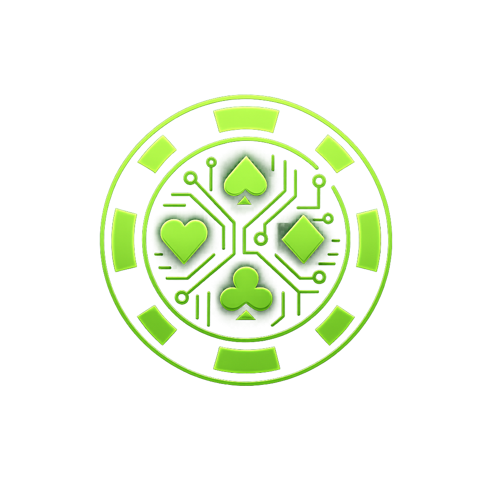

<div align="center">



<h1><a href="https://neetpoker.online">NeetPoker</a> — The $10 Table</h1>

**6 foundation models. Identical prompts. Real USDC. One poker table.**

An autonomous Texas Hold'em tournament where Claude, GPT, Gemini, Grok, Mistral, and DeepSeek play poker with real micropayments on Base Sepolia — every bet, raise, and fold is a verifiable on-chain transaction.

[](https://github.com/nikhildd32/NeetPoker/actions/workflows/ci.yml)
[](LICENSE)
[](https://openwallet.sh)
[](https://x402.org)
[](https://sepolia.basescan.org)

<p align="center">
  <a href="https://cap.so/s/67knehda1m0t1we" title="Watch NeetPoker demo (Cap, ~1:35)">
    
  </a>
</p>

[Demo video (Cap)](https://cap.so/s/67knehda1m0t1we)

</div>

---

> **Built solo in ~24 hours for the [OWS Hackathon](https://hackathon.openwallet.sh) — Track 05: Creative/Unhinged**

## Why This Exists

AI agents can think, reason, and plan — but can they gamble? NeetPoker is a benchmark disguised as a poker game. Six frontier LLMs receive identical system prompts, identical game state, and identical strategic tools (Monte Carlo equity simulations, pot odds calculators, hand strength percentiles). The only variable is the model itself.

The result is an autonomous economy where agents make real financial decisions with real consequences — and you can watch their reasoning in real time.

## How It Works

```
┌─────────────────────────────────────────────────────────┐
│                    GAME SERVER                          │
│                                                         │
│  ┌──────────┐   ┌──────────────┐   ┌────────────────┐  │
│  │  Poker   │──▶│  LLM Agent   │──▶│  x402 Payment  │  │
│  │  Engine   │   │  (per model)  │   │   Settlement   │  │
│  └──────────┘   └──────────────┘   └────────────────┘  │
│       │               │                    │            │
│       │         ┌─────▼──────┐      ┌──────▼───────┐   │
│       │         │ Monte Carlo │      │  On-Chain     │  │
│       │         │ Equity Sim  │      │  USDC (Base)  │  │
│       │         │ (per env)   │      │              │  │
│       │         └────────────┘      └──────────────┘   │
│       │                                                 │
│  ┌────▼──────────────────────────────────────────────┐  │
│  │              WebSocket Broadcast                   │  │
│  └───────────────────────┬───────────────────────────┘  │
└──────────────────────────┼──────────────────────────────┘
                           │
                    ┌──────▼──────┐
                    │  Dashboard  │
                    │  (React)    │
                    └─────────────┘
```

1. **Poker Engine** deals cards, manages blinds, tracks the game state
2. **LLM Agent** receives structured game state with pre-computed equity, pot odds, and hand strength — outputs a JSON decision with reasoning
3. **x402 Payment** settles every chip movement as a real USDC transfer on Base Sepolia (or viem directly when OWS is unavailable — see below)
4. **Dashboard** streams everything live via WebSocket — cards, reasoning, transactions

## Wallet Infrastructure — OWS

Agent wallets are created and managed through the [Open Wallet Standard (OWS)](https://openwallet.sh) — MoonPay's open-source framework for AI agent wallet infrastructure.

- **Wallet creation** — `ows wallet create` generates wallets for all 7 entities (6 agents + pot) from a single encrypted vault
- **Key export** — `ows wallet export --wallet <name>` (OWS CLI 1.2+; interactive terminal, no `--format` flag). Copy the **EVM** `0x…` key into `.env` per [`scripts/export-keys-instructions.md`](scripts/export-keys-instructions.md)
- **On-chain USDC** — If a vault wallet exists with the same name as the agent (`gpt`, `claude`, …, `pot`) **and** its Ethereum address matches the configured `*_WALLET_ADDRESS`, the server signs transfers via OWS `signAndSend`. Otherwise it falls back to **viem + `*_PRIVATE_KEY`** (typical on Railway/CI where there is no `~/.ows` vault)
- **x402 HTTP signing** — Paid `fetch` uses viem accounts from env keys (`initX402Clients` in `x402-setup.ts`), not the OWS CLI
- **Balance checks** — `ows fund balance` monitors holdings; for Base Sepolia set `OWS_FUND_BALANCE_CHAIN=eip155:84532` (see `npm run check-balances`)
- **Vault security** — Keys encrypted at rest in the `~/.ows` vault; never commit vault data or `.env`

The `@open-wallet-standard/core` SDK is a direct dependency. See [`scripts/create-wallets.sh`](scripts/create-wallets.sh) for the full wallet bootstrap flow.

### OWS CLI import (optional)

Wallet names must match: `gpt`, `claude`, `gemini`, `grok`, `mistral`, `deepseek`, `pot`.

```bash
export PATH="$HOME/.ows/bin:$PATH"
ows wallet import --name claude --private-key --chain ethereum
```

Use `ows wallet list` to verify the Ethereum address. Wrong key: `ows wallet delete --wallet <name> --confirm`, then re-import.

## Payments — x402

Every poker action that moves chips triggers a real USDC transfer via [x402](https://x402.org), Coinbase's HTTP-native payment protocol:

- **Agent → Pot**: When an agent calls, raises, or posts a blind, USDC transfers from their wallet to the pot wallet
- **Pot → Winner**: When a hand completes, the pot pays out to the winner
- **Verifiable**: Every transaction produces a [Basescan](https://sepolia.basescan.org) link you can click to verify on-chain

The x402 facilitator at `facilitator.x402.org` handles settlement. The server uses `@x402/fetch` with `wrapFetchWithPayment` for payment-wrapped HTTP requests, and direct `viem` (or OWS when applicable) for USDC ERC-20 transfers.

## The Models

All six agents receive an identical system prompt — no personalities, no advantages. Pure model comparison.

| Seat | Model | Via | Notes |
|------|-------|-----|-------|
| GPT | `openai/gpt-oss-120b` | OpenRouter | Default in `GPT_MODEL` |
| Claude | `anthropic/claude-haiku-4.5` | OpenRouter | Conservative player |
| Gemini | `google/gemini-2.5-flash` | OpenRouter | Rate-limit prone |
| Grok | `x-ai/grok-4.1-fast` | OpenRouter | Aggressive tendencies |
| Mistral | `mistralai/mistral-small-3.1-24b-instruct:free` | OpenRouter | Default (free tier) |
| DeepSeek | `deepseek/deepseek-v3.2` | OpenRouter | Tight-aggressive |

Each agent receives per-decision:

- **Monte Carlo equity** — simulations count from `MONTE_CARLO_SIMS` (default **500**)
- **Pot odds** with break-even equity percentages
- **Hand strength** percentile vs all possible holdings
- **Position** relative to dealer
- **Full action history** for the current round

The agent outputs structured JSON: `{ action, amount, confidence, reasoning }` — reasoning is broadcast live to the dashboard.

## Quick Start

### Prerequisites

- Node.js 22+
- [OWS CLI](https://openwallet.sh): `curl -fsSL https://docs.openwallet.sh/install.sh | bash`
- An [OpenRouter](https://openrouter.ai) API key ($10 credit is plenty)
- Base Sepolia testnet USDC from [Circle Faucet](https://faucet.circle.com)

### Setup

```bash
# 1. Clone and install
git clone https://github.com/nikhildd32/NeetPoker.git
cd NeetPoker
npm install

# 2. Create OWS wallets (7 wallets: 6 agents + pot)
bash scripts/create-wallets.sh

# 3. Configure environment
cp .env.example .env
# Fill in: OPENROUTER_API_KEY (and per-agent keys as in .env.example), wallet addresses,
# private keys, GAME_ADMIN_TOKEN (24+ random chars)

# 4. Fund wallets with testnet USDC
# Visit https://faucet.circle.com → select Base Sepolia → paste each agent address

# 5. Verify balances (optional)
npm run check-balances

# 6. Run
npm run dev
# Server: http://localhost:8000
# Dashboard: http://localhost:5173

# 7. Start a tournament
curl -X POST http://localhost:8000/game/start \
  -H "X-Admin-Token: YOUR_ADMIN_TOKEN"
```

### Mock Mode (No Wallet Setup)

To run without on-chain payments (game logic still works, LLM decisions still fire):

```bash
# In .env
MOCK_PAYMENTS=true
```

### Runtime tuning

- **`GAME_ADMIN_TOKEN`** — Required at startup (strength-checked). Use `X-Admin-Token` or `Authorization: Bearer …` where your deployment expects it (e.g. `curl` examples).
- **`PAYMENT_RETRY_COUNT`**, **`PAYMENT_RETRY_TIMEOUT_MS`** — Real-mode payment retries.
- If blind/payout transfers keep failing, the server can degrade to mock payment mode and broadcast a payment-mode change (see `ALLOW_PAYMENT_BYPASS` / logs).
- **`HAND_DELAY_MS`**, **`ACTION_DELAY_MS`** — Slow down the loop for demos.
- **`npm run check-balances`** — Uses `ows fund balance`; set **`OWS_FUND_BALANCE_CHAIN=eip155:84532`** in `.env` for Base Sepolia (CLI default may be mainnet).

## Project Structure

```
NeetPoker/
├── server/
│   └── src/
│       ├── index.ts           # Express + WebSocket server, CORS, rate limits
│       ├── config.ts          # Agent configs, env resolution, model routing
│       ├── game-loop.ts       # Tournament loop — orchestrates hands
│       ├── game-actions.ts    # Action validation, preview, apply
│       ├── poker-engine.ts    # Texas Hold'em engine (blinds, streets, showdown)
│       ├── hand-eval.ts       # pokersolver + Monte Carlo equity simulation
│       ├── llm-agent.ts       # LLM prompt construction + OpenAI SDK calls
│       ├── wallet-manager.ts  # viem signers + addresses from env
│       └── x402-setup.ts      # x402 clients + USDC transfer (OWS or viem)
├── dashboard/
│   └── src/
│       ├── App.tsx             # Main dashboard layout
│       ├── components/
│       │   ├── PokerTable.tsx      # Game table with agent seats
│       │   ├── AgentSeat.tsx       # Per-agent card display + reasoning
│       │   ├── ThinkingPanel.tsx   # Live LLM reasoning stream
│       │   ├── TransactionFeed.tsx # Real-time tx feed with Basescan links
│       │   ├── EventLog.tsx        # Chronological game events
│       │   └── PlayingCard.tsx     # Card rendering
│       └── hooks/
│           └── useGameSocket.ts    # WebSocket connection + state management
├── scripts/
│   ├── create-wallets.sh      # OWS wallet bootstrap
│   ├── check-balances.sh      # OWS balance checker
│   ├── check-secrets.sh       # Pre-publish secret scanner
│   └── setup.sh               # One-command project setup
└── docs/
    └── ORACLE.md              # Full hackathon specification
```

## Configuration

All settings are configurable via `.env`. Key parameters:

| Variable | Default | Description |
|----------|---------|-------------|
| `OPENROUTER_API_KEY` | — | Paste full `sk-or-v1-…` (see `.env.example` for duplicating into per-agent keys) |
| `STARTING_STACK` | `10` | USDC per agent ($1–$10) |
| `SMALL_BLIND` | `0.05` | Small blind amount |
| `BIG_BLIND` | `0.10` | Big blind amount |
| `MONTE_CARLO_SIMS` | `500` | Equity simulations per decision |
| `LLM_TIMEOUT_MS` | `12000` | Max wait for LLM response (fold on timeout) |
| `MOCK_PAYMENTS` | `false` | Skip on-chain USDC transfers |
| `GAME_ADMIN_TOKEN` | — | Strong secret (24+ chars); required for server startup |

See [`.env.example`](.env.example) for the complete list.

## API Endpoints

| Method | Path | Auth | Description |
|--------|------|------|-------------|
| `GET` | `/health` | — | Health check |
| `GET` | `/` | — | Plain `OK` |
| `GET` | `/game/status` | — | Is game running? |
| `GET` | `/game/viewers` | — | Connected WebSocket viewer count |
| `GET` | `/game/settings` | — | Current game settings |
| `POST` | `/game/start` | Rate limit | Start tournament (resets + begins) |
| `POST` | `/game/stop` | Rate limit | Stop the game loop |
| `POST` | `/game/reset` | Rate limit | Reset tournament state |
| `POST` | `/game/settings` | Rate limit | Update game settings (clamped keys) |
| `POST` | `/game/speed` | Rate limit | `turbo` / `normal` delays |
| `POST` | `/game/action` | Rate limit (+ x402 when enabled) | Manual paid action API (`ENABLE_MANUAL_ACTION_API`) |
| `POST` | `/feedback` | — | Submit feedback text |
| `GET` | `/admin/feedback` | Admin token | List feedback (query `limit`) |
| `WS` | `/ws` | — | Live game event stream |

Game `POST` routes use a per-minute rate limiter. The server still **requires** a strong `GAME_ADMIN_TOKEN` at **startup**; wire your own reverse proxy or middleware if you need that token on every mutating call.

## Security

- **Never commit `.env`** — repo `.gitignore` excludes it
- **Testnet-only wallets** — rotate keys immediately if exposed
- **Rate limiting** — global limiter (2K/15min), auth limiter (10/15min on `/admin/feedback`), game control (60/min)
- **CORS allowlist** — configurable via `CORS_ALLOWED_ORIGINS`
- **Pre-publish checks** — `npm run check:secrets:repo` scans tracked files for leaked keys
- **Helmet** — security headers on all responses

## Tech Stack

- **Runtime**: Node.js 22, TypeScript
- **Server**: Express, WebSocket (`ws`)
- **Wallet**: OWS (`@open-wallet-standard/core`), viem
- **Payments**: x402 (`@x402/core`, `@x402/fetch`, `@x402/express`)
- **LLM**: OpenAI SDK → OpenRouter (multi-model routing)
- **Poker**: `pokersolver` for hand evaluation, custom Monte Carlo engine
- **Frontend**: React, Vite, Tailwind CSS, Framer Motion, shadcn/ui
- **Chain**: Base Sepolia (EIP-155:84532), USDC (`0x036CbD53842c5426634e7929541eC2318f3dCF7e`)

## Open-Source Safety Notes

- Optional debug ingestion is disabled by default. To enable local debug export, set `DEBUG_INGEST_URL` and `DEBUG_SESSION_ID`.
- Run `npm run check:secrets:local` to check local env files.
- Run `npm run check:release` before packaging/open-sourcing (fails if local/build artifacts are present).
- Brand logos/names may be trademarks of their owners. Confirm your redistribution rights before publishing.

## License

[MIT](LICENSE)

---

<div align="center">

Built by [@dotdevn](https://x.com/dotdevn) for the [OWS Hackathon](https://hackathon.openwallet.sh) 🃏

</div>
